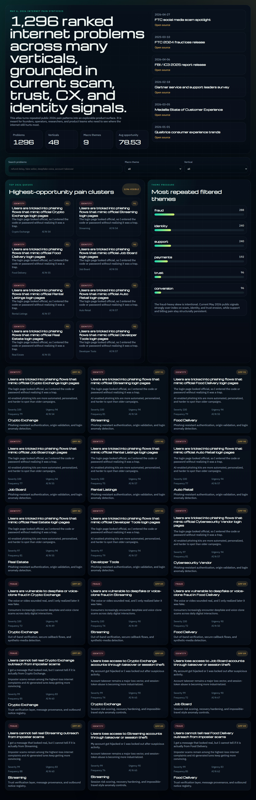
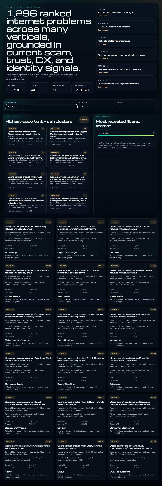

# Internet Problem Atlas

`internet-problem-atlas` is a research-backed product intelligence repo that turns current internet pain patterns into a structured, explorable dataset.

As of **May 6, 2026**, the most repeated user pain clusters showing up across current reports are:

- scams, fraud, impersonation, and investment traps
- account takeover, credential theft, and identity abuse
- online support friction and weak AI-to-human handoff
- billing, refund, subscription, and checkout confusion
- marketplace trust, fake sellers, fake reviews, and delivery ambiguity
- privacy and transparency gaps around data usage

This repo turns those macro-signals into **1,296 seeded problems** across many verticals so builders can search, rank, cluster, and productize them.

## Important methodology note

It is not realistic to manually verify "100,000+ verticals" one by one. Instead, this repo does something honest and useful:

- synthesizes current May 2026 public evidence from major reports
- defines a broad vertical taxonomy
- defines recurring internet-native problem archetypes
- generates a large, source-informed atlas of 1,296 problems

That yields a large exploration surface without pretending a literal manual read of 100,000 distinct industries.

## What's inside

- Python problem generator and CLI
- 1,296 generated problem records
- summary and CSV exports
- React dashboard with filters, search, and ranking
- browser screenshots
- tests and CI

## Screenshots




## Dataset shape

Each problem record includes:

- `vertical`
- `macro_theme`
- `problem_slug`
- `problem_title`
- `user_phrase`
- `why_now_2026`
- `severity_score`
- `urgency_score`
- `frequency_score`
- `opportunity_score`
- `ai_fit_score`
- `evidence_sources`
- `solution_direction`

## Quick start

### Python

```bash
python -m pip install -e .[dev]
problem-atlas generate --json-out results/problems.json --summary-out results/summary.json --csv-out results/problems.csv
problem-atlas search --query "refund fraud" --limit 10
```

### Frontend

```bash
npm install
npm run generate:data
npm run build:web
npm run preview:web
```

## CLI

```bash
problem-atlas generate [--json-out FILE] [--summary-out FILE] [--csv-out FILE]
problem-atlas search --query "deepfake payment" [--limit 10]
```

## Repo layout

```text
internet-problem-atlas/
|-- apps/web/                    # React dashboard
|-- docs/                        # research note, audit, screenshots
|-- results/                     # generated JSON, summary, CSV
|-- src/internet_problem_atlas/  # generator, scoring, search, CLI
|-- tests/                       # dataset + browser tests
|-- tools/                       # generation utility
`-- .github/workflows/           # CI
```

## Research basis

The problem atlas is informed by current public sources from:

- FTC
- FBI / IC3
- Gartner
- Medallia
- Qualtrics
- McAfee
- TransUnion
- Microsoft Security

Details and links are in [docs/problem-brief.md](docs/problem-brief.md).

## Verification

Final verification notes are in [docs/final-audit.md](docs/final-audit.md).

## License

MIT
